# AI Content Generator

A responsive AI content generation web app built with Next.js 16, React 19, Tailwind CSS v4, and CSS Modules — implemented as a frontend technical assessment.

---

## Tech Stack

| Layer | Choice |
|---|---|
| Framework | Next.js 16 (App Router) |
| Language | JavaScript |
| Styling | Tailwind CSS v4 + CSS Modules |
| Animation | Framer Motion |
| State | React Context + useReducer |
| Images | `next/image` with picsum.photos mock |

---

## Setup & Running Locally

```bash
npm install
npm run dev
# Open http://localhost:3000
```

**Production build:**
```bash
npm run build && npm start
```

---

## Project Structure

```
app/
├── api/generate/route.js   # Dummy POST endpoint
├── globals.css             # Design tokens (CSS vars) + Tailwind
├── layout.js               # Root layout with Providers
└── page.js                 # Renders AppShell

components/
├── layout/   AppShell, Header, Providers
├── history/  HistoryPanel, HistoryStrip, HistoryThumbnail, HistoryDrawer
├── prompt/   PromptCard, PromptInput, MediaToggle, ModelSelector,
│             ImageCountSelector, AdvancedPanel, StylesPanel, GenerateButton
├── results/  ResultsGrid, ResultCard, ResultSkeleton
├── theme/    ThemeToggle
└── ui/       Button, IconButton, Dropdown, SegmentedControl,
              Collapsible, Icon

context/
├── ThemeProvider.jsx       # theme + toggleTheme (localStorage + system pref)
└── GenerationProvider.jsx  # All generation state via useReducer

hooks/  useMediaQuery
lib/    api client, constants (models/styles), mocks (images/videos/history), utils
```

---

## Key Design Decisions

**Tailwind v4 + CSS Modules together** — Tailwind handles layout, spacing, and responsive utilities. CSS Modules hold complex component styles (gradient buttons, shimmer, hover overlays) that would be awkward as utility strings.

**CSS variables for theming** — All colours live as `--accent`, `--bg`, `--surface`, etc. The `.dark` class on `<html>` swaps them. No Tailwind `dark:` utilities needed — every component is automatically theme-aware.

**Context + useReducer, no global store** — State split into two contexts (state / dispatch) to avoid re-rendering consumers that only read one slice. `React.memo` on `ResultCard` and `HistoryThumbnail`.

**Dummy API shape** — `POST /api/generate` accepts `{ prompt, type, model, count }`, waits 900–1500ms, returns `{ id, type, prompt, items[], createdAt }` — the same contract a real model API would return.

**Mobile-first responsive** — Three layouts: ≤767px (single-column, history drawer), 768–1023px (two-column), ≥1024px (full three-column mockup layout).

---

## Features

- Prompt textarea with character count
- Image / Video mode toggle
- Image count selector (1 / 2 / 4 / 8)
- Model selector dropdown (5 mock models)
- Advanced panel: CFG scale, steps, seed, negative prompt
- Styles panel: multi-select style chips
- Orange gradient Generate button with spinner
- 4-col results grid → 3-col → 2-col (responsive)
- Hover overlay: Like / Download / Share per image
- Shimmer skeleton loading state
- History sidebar + horizontal header strip
- Mobile history slide-in drawer
- Dark mode (localStorage + `prefers-color-scheme` default)
- Accessibility: semantic HTML, `aria-*` attributes, visible focus rings, alt text

---

## Responsiveness Tested

| Viewport | Layout |
|---|---|
| 320px | Single column, condensed header |
| 375px | Single column |
| 390px | Single column (iPhone 14) |
| 768px | Prompt sidebar + Results |
| 1280px | Full layout |
| 1440px | Full layout, wider grid |

### Screenshots

#### Desktop (1440px)
| Dark | Light |
|---|---|
| 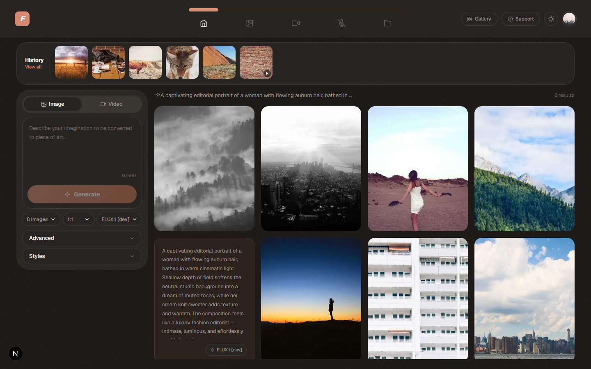 | 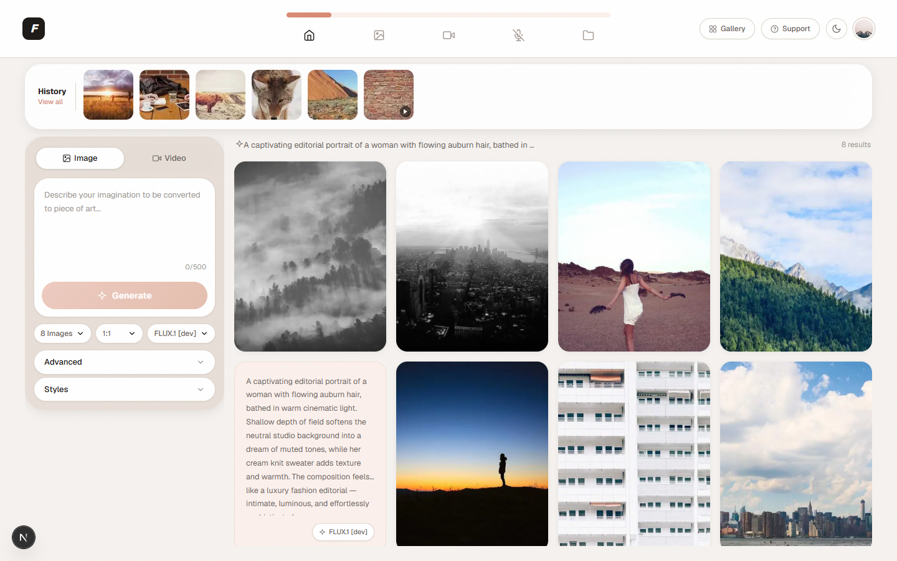 |

#### Desktop (1280px)
| Dark | Light |
|---|---|
| 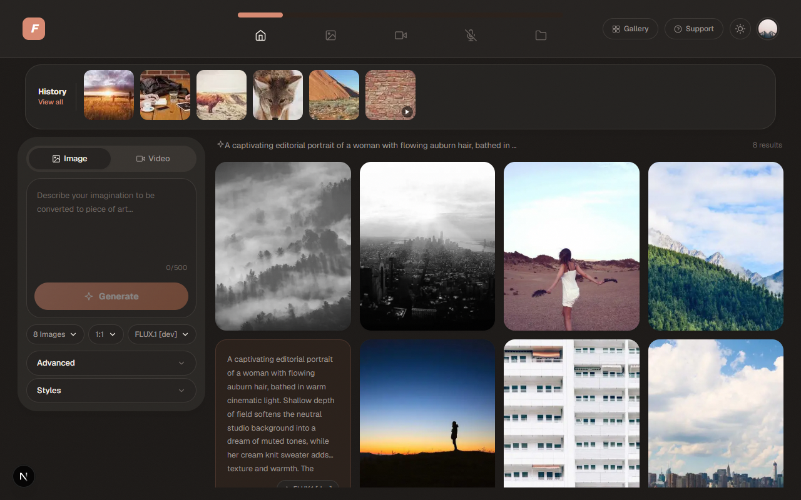 | 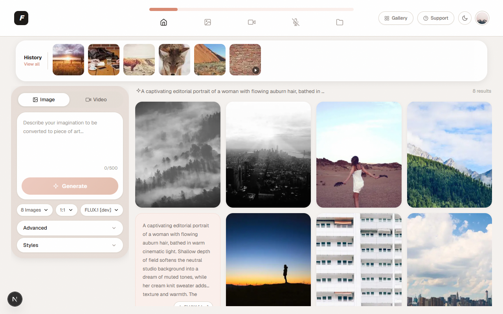 |

#### Tablet (768px)
| Dark | Light |
|---|---|
| 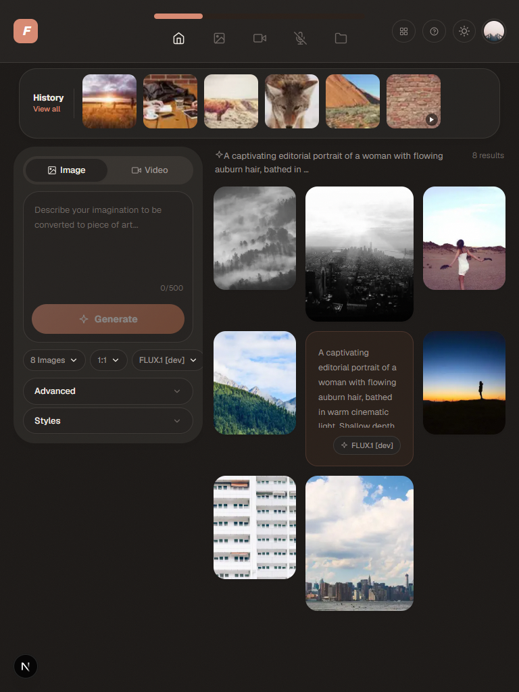 | 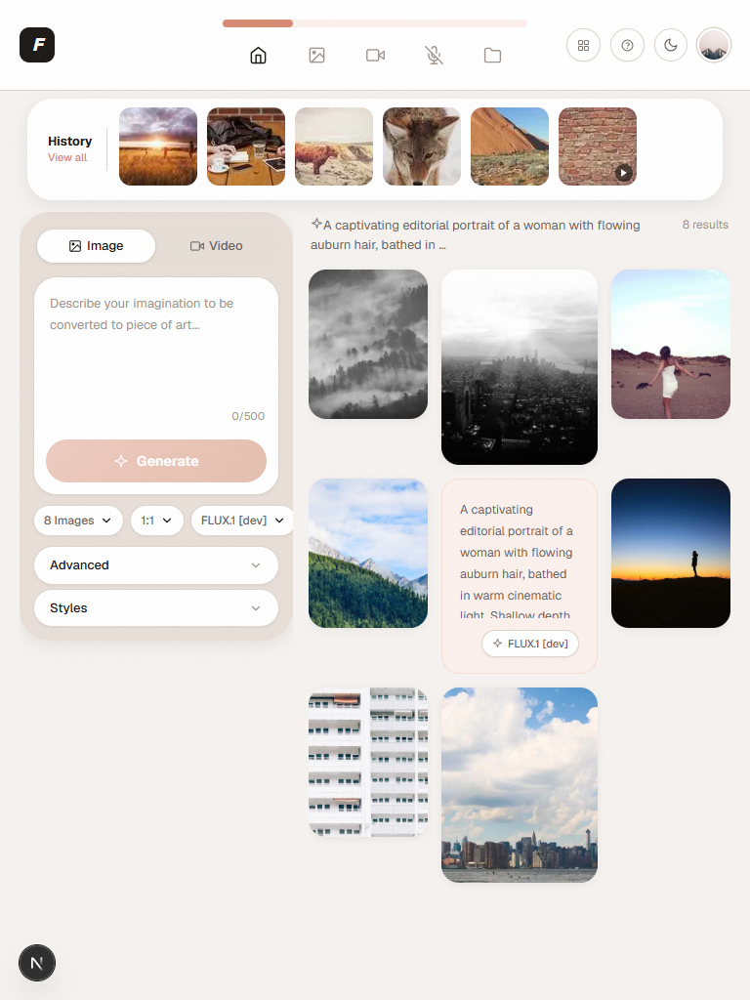 |

#### Mobile (390px — iPhone 14)
| Dark | Light |
|---|---|
| 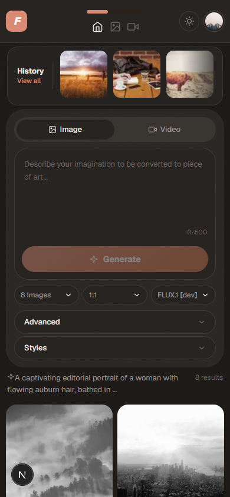 | 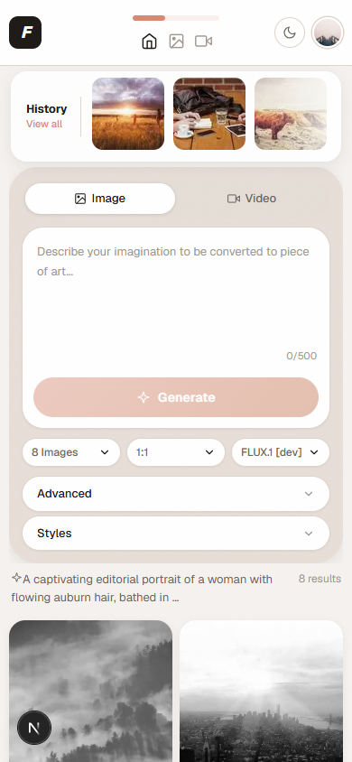 |

#### Mobile (375px — iPhone SE)
| Dark | Light |
|---|---|
| 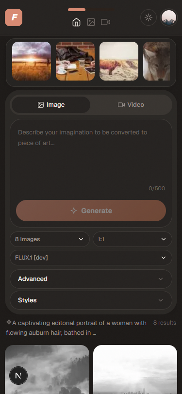 | 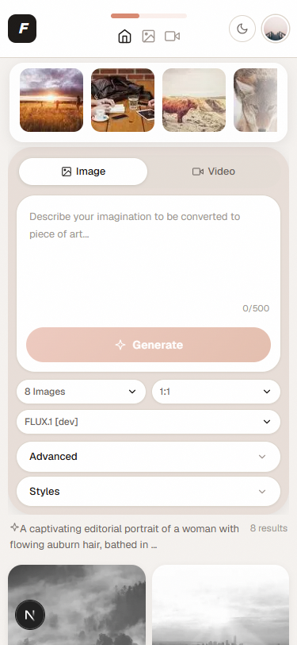 |

#### Mobile (320px — minimum supported)
| Dark | Light |
|---|---|
| 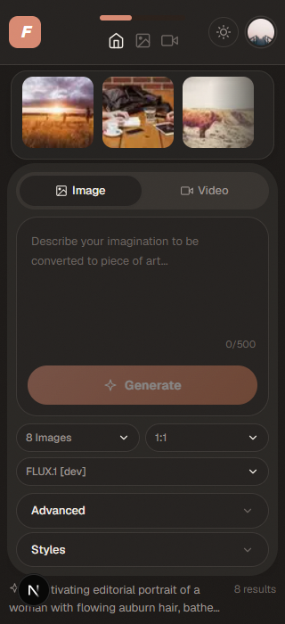 | 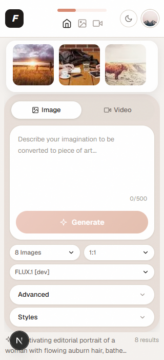 |
